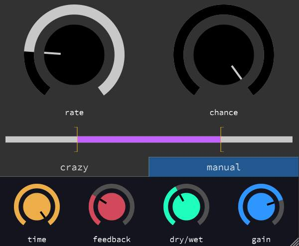

# Chaotic Delay


Varispeed buffer reading and writing for impressive sounds.



### Demo Video
[](https://www.youtube.com/watch?v=bvbjJuZpEaM)

# Clone & Build
```
git clone --recursive https://github.com/ctsexton/chaotic_delay.git
mkdir build && cd build
cmake ..
cmake --build .
```

# Run Tests
After building, simply run the following from the build directory:
```
ctest --verbose
```
